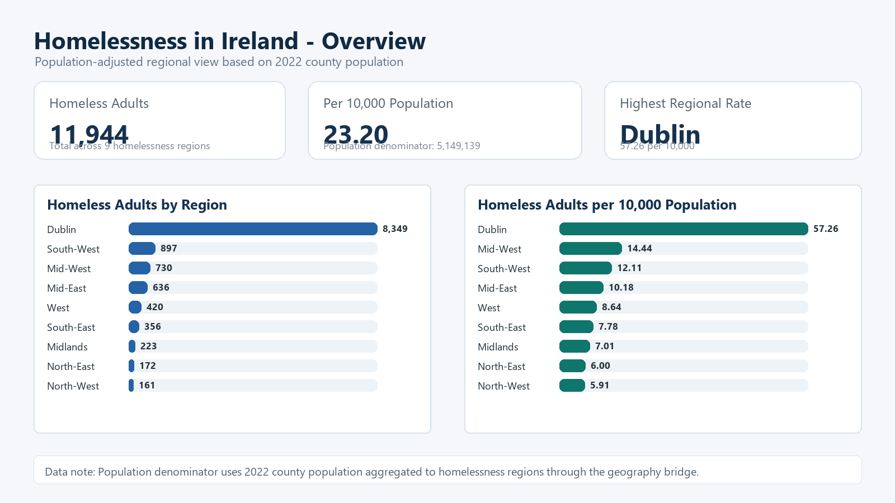
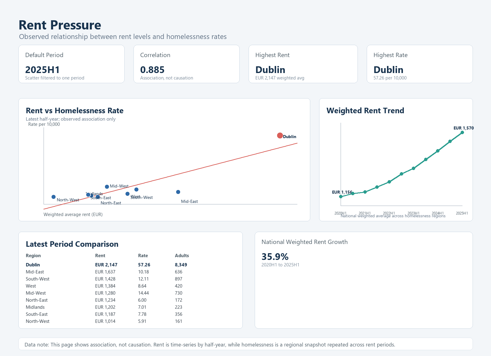
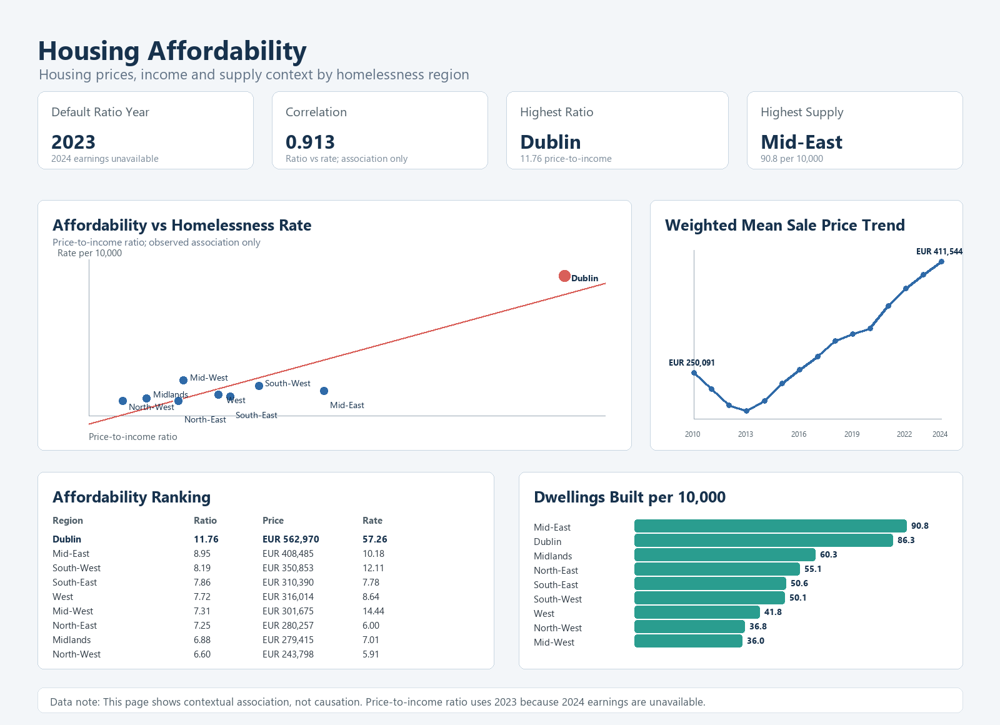

# Ireland Homelessness Analytics Capstone

End-to-end analytics project exploring regional homelessness patterns in Ireland using public datasets on homelessness, population, rent, housing, and unemployment.

The project follows a full analytics workflow: business framing, data validation, standardisation, geography bridge design, SQL database build, analytical SQL views, Power BI-ready report pages, executive summary, and final presentation.

## Project Objective

The objective is to compare homelessness across Irish regions using population-adjusted indicators and to understand how housing market and economic context relate to regional homelessness patterns.

The main analytical KPI is:

```text
Homeless Adults per 10,000 Population
```

## Key Findings

- Ireland records `11,944` homeless adults in the analysed dataset.
- The national homelessness rate is `23.2` adults per 10,000 population.
- Dublin has the highest homelessness rate at `57.26` adults per 10,000 population.
- Adults aged `25-44` are the largest demographic group, representing `52.37%` of homeless adults.
- Private Emergency Accommodation is the dominant accommodation type, representing `71.5%` of adults across regions.
- Rent pressure and housing affordability show strong positive associations with homelessness rates in the prepared analysis layer.
- Unemployment data should be interpreted cautiously because it is only available at NUTS2 level.

## Repository Structure

```text
Project/
  Build Artifacts/        Geography bridge table
  Clean Data/             Standardised clean CSV files
  Documentation/          Data standards and project notes
  Power BI/               Power BI-ready extracts, specs and mockups
  SQL/                    SQLite database, SQL views and SQL reports

outputs/                  Final shareable artifacts
work/                     Reproducible build scripts and intermediate work
```

## Main Deliverables

| Deliverable | File |
|---|---|
| SQL database | `Project/SQL/ireland_homelessness.db` |
| Analytical SQL views | `Project/SQL/15_create_analytical_views.sql` |
| Executive summary | `outputs/executive_summary.md` |
| Final presentation | `outputs/ireland_homelessness_capstone_presentation.pptx` |
| Power BI solution design | `outputs/power_bi_solution_design.md` |
| Data notes | `outputs/data_notes_page_build_spec.md` |

## Power BI Pages Designed

1. Overview
2. Regional Rates
3. Demographics
4. Accommodation
5. Rent Pressure
6. Housing Affordability
7. Economic Context
8. Data Notes
9. Executive Summary

## Example Report Mockups

### Overview



### Rent Pressure



### Housing Affordability



## SQL Layer

The SQL layer builds analytical views for:

- `vw_homelessness_rate_per_10000`
- `vw_demographic_profile`
- `vw_accommodation_profile`
- `vw_rent_pressure`
- `vw_housing_affordability`
- `vw_unemployment_context`

These views separate analytical logic from the Power BI presentation layer.

## Data Notes

The report should be interpreted with the following limitations:

- Homelessness data is reported by homelessness region.
- Population, rent and housing data are county-based and are aggregated through a geography bridge.
- Unemployment data is only available at NUTS2 level.
- North-East spans two NUTS2 regions and should be interpreted carefully.
- Rent and housing indicators show association, not causation.
- Accommodation category totals do not perfectly equal total adults in every region.

## Recommendations

1. Use homelessness rate per 10,000 population as the primary KPI for comparing regions.
2. Monitor regions where high homelessness rates overlap with high housing affordability and rent pressure.
3. Publish geography caveats when comparing county, homelessness-region and NUTS2-level data.
4. Expand future datasets with richer housing-market indicators to support deeper analysis.

## Tools Used

- Excel / CSV data preparation
- Python for data standardisation and artifact generation
- SQLite for database build and analytical views
- Power BI design layer
- PowerPoint final presentation

## Status

This repository contains a completed capstone analytics project package ready for portfolio review.
