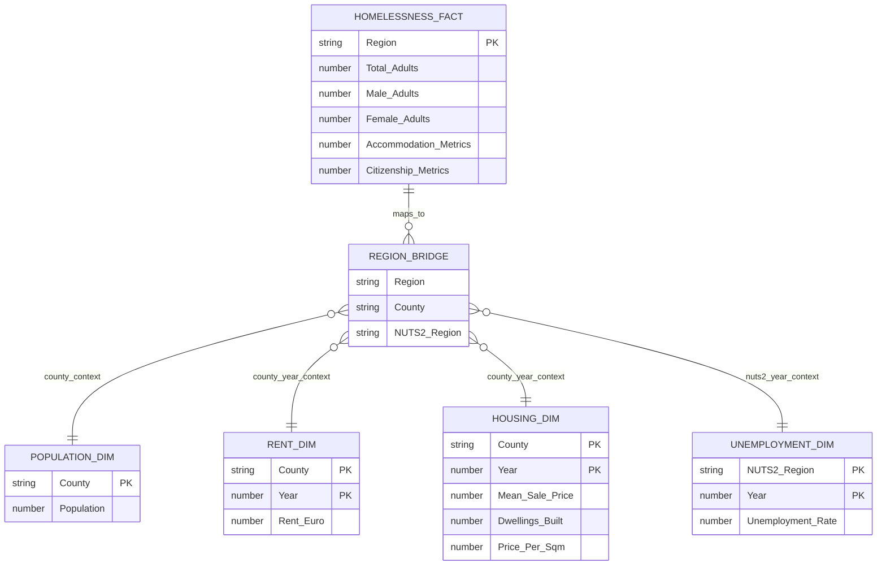

# Task 4 - Dataset Profiling & Data Model Design

## Dataset Profiling

| Dataset | Grain | Key | Future Role |
|---|---|---|---|
| Homelessness | Region | Region | Fact |
| Population | County | County | Dimension |
| Rent | County | County + Year | Dimension |
| Housing | County | County + Year | Dimension |
| Unemployment | NUTS2 | Region + Year | Dimension |

## Interpretation

The homelessness dataset is the analytical centre of the future project. It contains the outcome we want to explain: homelessness levels and composition by region.

The other datasets provide explanatory context:

| Dataset | Analytical Purpose |
|---|---|
| Population | Normalise homelessness counts by population size |
| Rent | Test relationship between rent pressure and homelessness |
| Housing | Test relationship between housing prices / supply and homelessness |
| Unemployment | Test relationship between labour market conditions and homelessness |

## First Data Model

## Model Design Notes

This should be treated as a conceptual model, not yet a final SQL schema.

The main modelling issue is geography. Homelessness is currently regional, while population, rent, and housing are county-level datasets. Unemployment is NUTS2-level. Because of this, the model needs a geography bridge table before reliable joins can be built.

The future SQL model should therefore include:

| Table | Purpose |
|---|---|
| `homelessness_fact` | Main outcome table |
| `region_bridge` | Maps homelessness regions to counties and NUTS2 regions |
| `population_dim` | County-level population context |
| `rent_dim` | County-year rent context |
| `housing_dim` | County-year housing market context |
| `unemployment_dim` | NUTS2-year unemployment context |

## Answer to the Four Questions

| Question | Answer |
|---|---|
| What is the grain of each table? | Region, County, County-Year, or NUTS2-Year depending on dataset |
| What is the key of each table? | Region, County, County + Year, or Region/NUTS2 + Year |
| What role will each table play? | Homelessness is the Fact table; all others are Dimensions |
| Can the tables be joined directly? | Not safely yet; a geographic bridge table is required |

## Conclusion

The future data model should use homelessness as the central fact table and attach social, economic, and housing context through dimension tables.

Before opening SQL, the next modelling requirement is to create a clean geography mapping table that connects:

- Homelessness Region
- County
- NUTS2 Region

That bridge will make the future joins explicit, auditable, and suitable for analysis.
